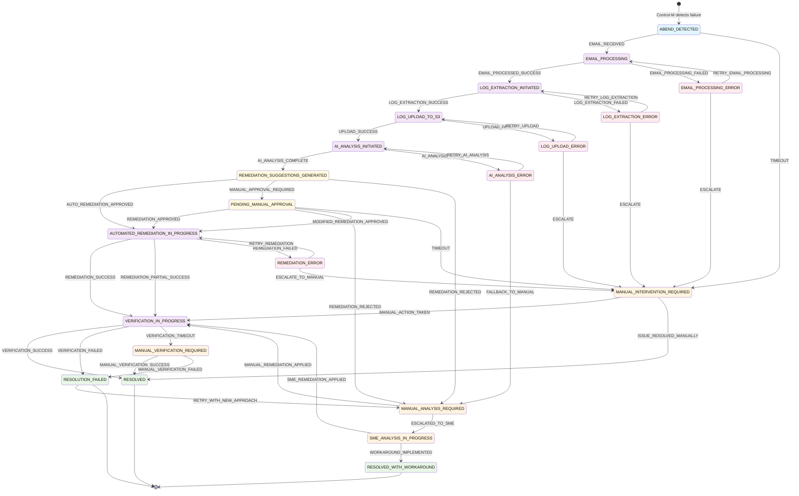

```mermaid
stateDiagram-v2
    [*] --> ABEND_DETECTED : Control-M detects failure
    
    ABEND_DETECTED --> EMAIL_PROCESSING : EMAIL_RECEIVED
    ABEND_DETECTED --> MANUAL_INTERVENTION_REQUIRED : TIMEOUT
    
    EMAIL_PROCESSING --> LOG_EXTRACTION_INITIATED : EMAIL_PROCESSED_SUCCESS
    EMAIL_PROCESSING --> EMAIL_PROCESSING_ERROR : EMAIL_PROCESSING_FAILED
    
    EMAIL_PROCESSING_ERROR --> EMAIL_PROCESSING : RETRY_EMAIL_PROCESSING
    EMAIL_PROCESSING_ERROR --> MANUAL_INTERVENTION_REQUIRED : ESCALATE
    
    LOG_EXTRACTION_INITIATED --> LOG_UPLOAD_TO_S3 : LOG_EXTRACTION_SUCCESS
    LOG_EXTRACTION_INITIATED --> LOG_EXTRACTION_ERROR : LOG_EXTRACTION_FAILED
    
    LOG_EXTRACTION_ERROR --> LOG_EXTRACTION_INITIATED : RETRY_LOG_EXTRACTION
    LOG_EXTRACTION_ERROR --> MANUAL_INTERVENTION_REQUIRED : ESCALATE
    
    LOG_UPLOAD_TO_S3 --> AI_ANALYSIS_INITIATED : UPLOAD_SUCCESS
    LOG_UPLOAD_TO_S3 --> LOG_UPLOAD_ERROR : UPLOAD_FAILED
    
    LOG_UPLOAD_ERROR --> LOG_UPLOAD_TO_S3 : RETRY_UPLOAD
    LOG_UPLOAD_ERROR --> MANUAL_INTERVENTION_REQUIRED : ESCALATE
    
    AI_ANALYSIS_INITIATED --> REMEDIATION_SUGGESTIONS_GENERATED : AI_ANALYSIS_COMPLETE
    AI_ANALYSIS_INITIATED --> AI_ANALYSIS_ERROR : AI_ANALYSIS_FAILED
    
    AI_ANALYSIS_ERROR --> AI_ANALYSIS_INITIATED : RETRY_AI_ANALYSIS
    AI_ANALYSIS_ERROR --> MANUAL_ANALYSIS_REQUIRED : FALLBACK_TO_MANUAL
    
    REMEDIATION_SUGGESTIONS_GENERATED --> AUTOMATED_REMEDIATION_IN_PROGRESS : AUTO_REMEDIATION_APPROVED
    REMEDIATION_SUGGESTIONS_GENERATED --> PENDING_MANUAL_APPROVAL : MANUAL_APPROVAL_REQUIRED
    REMEDIATION_SUGGESTIONS_GENERATED --> MANUAL_ANALYSIS_REQUIRED : REMEDIATION_REJECTED
    
    PENDING_MANUAL_APPROVAL --> AUTOMATED_REMEDIATION_IN_PROGRESS : REMEDIATION_APPROVED
    PENDING_MANUAL_APPROVAL --> MANUAL_ANALYSIS_REQUIRED : REMEDIATION_REJECTED
    PENDING_MANUAL_APPROVAL --> AUTOMATED_REMEDIATION_IN_PROGRESS : MODIFIED_REMEDIATION_APPROVED
    PENDING_MANUAL_APPROVAL --> MANUAL_INTERVENTION_REQUIRED : TIMEOUT
    
    AUTOMATED_REMEDIATION_IN_PROGRESS --> VERIFICATION_IN_PROGRESS : REMEDIATION_SUCCESS
    AUTOMATED_REMEDIATION_IN_PROGRESS --> VERIFICATION_IN_PROGRESS : REMEDIATION_PARTIAL_SUCCESS
    AUTOMATED_REMEDIATION_IN_PROGRESS --> REMEDIATION_ERROR : REMEDIATION_FAILED
    
    REMEDIATION_ERROR --> AUTOMATED_REMEDIATION_IN_PROGRESS : RETRY_REMEDIATION
    REMEDIATION_ERROR --> MANUAL_INTERVENTION_REQUIRED : ESCALATE_TO_MANUAL
    
    VERIFICATION_IN_PROGRESS --> RESOLVED : VERIFICATION_SUCCESS
    VERIFICATION_IN_PROGRESS --> RESOLUTION_FAILED : VERIFICATION_FAILED
    VERIFICATION_IN_PROGRESS --> MANUAL_VERIFICATION_REQUIRED : VERIFICATION_TIMEOUT
    
    MANUAL_ANALYSIS_REQUIRED --> VERIFICATION_IN_PROGRESS : MANUAL_REMEDIATION_APPLIED
    MANUAL_ANALYSIS_REQUIRED --> SME_ANALYSIS_IN_PROGRESS : ESCALATED_TO_SME
    
    SME_ANALYSIS_IN_PROGRESS --> VERIFICATION_IN_PROGRESS : SME_REMEDIATION_APPLIED
    SME_ANALYSIS_IN_PROGRESS --> RESOLVED_WITH_WORKAROUND : WORKAROUND_IMPLEMENTED
    
    MANUAL_VERIFICATION_REQUIRED --> RESOLVED : MANUAL_VERIFICATION_SUCCESS
    MANUAL_VERIFICATION_REQUIRED --> RESOLUTION_FAILED : MANUAL_VERIFICATION_FAILED
    
    MANUAL_INTERVENTION_REQUIRED --> VERIFICATION_IN_PROGRESS : MANUAL_ACTION_TAKEN
    MANUAL_INTERVENTION_REQUIRED --> RESOLVED : ISSUE_RESOLVED_MANUALLY
    
    RESOLUTION_FAILED --> MANUAL_ANALYSIS_REQUIRED : RETRY_WITH_NEW_APPROACH
    
    RESOLVED --> [*]
    RESOLVED_WITH_WORKAROUND --> [*]
    RESOLUTION_FAILED --> [*]

    classDef initialState fill:#e1f5fe
    classDef processingState fill:#f3e5f5
    classDef errorState fill:#ffebee
    classDef manualState fill:#fff3e0
    classDef terminalState fill:#e8f5e8
    classDef decisionState fill:#fff8e1
    
    class ABEND_DETECTED initialState
    class EMAIL_PROCESSING,LOG_EXTRACTION_INITIATED,LOG_UPLOAD_TO_S3,AI_ANALYSIS_INITIATED,AUTOMATED_REMEDIATION_IN_PROGRESS,VERIFICATION_IN_PROGRESS processingState
    class EMAIL_PROCESSING_ERROR,LOG_EXTRACTION_ERROR,LOG_UPLOAD_ERROR,AI_ANALYSIS_ERROR,REMEDIATION_ERROR errorState
    class MANUAL_ANALYSIS_REQUIRED,SME_ANALYSIS_IN_PROGRESS,VENDOR_ESCALATION,MANUAL_VERIFICATION_REQUIRED,MANUAL_INTERVENTION_REQUIRED manualState
    class RESOLVED,RESOLVED_WITH_WORKAROUND,RESOLUTION_FAILED terminalState
    class REMEDIATION_SUGGESTIONS_GENERATED,PENDING_MANUAL_APPROVAL decisionState
```
 